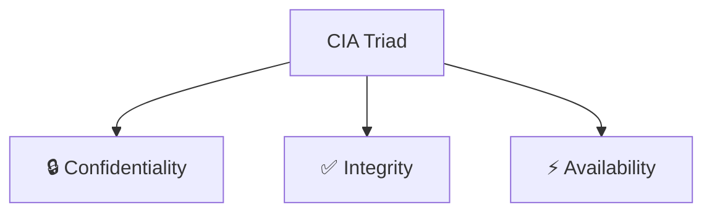
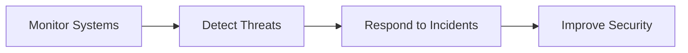
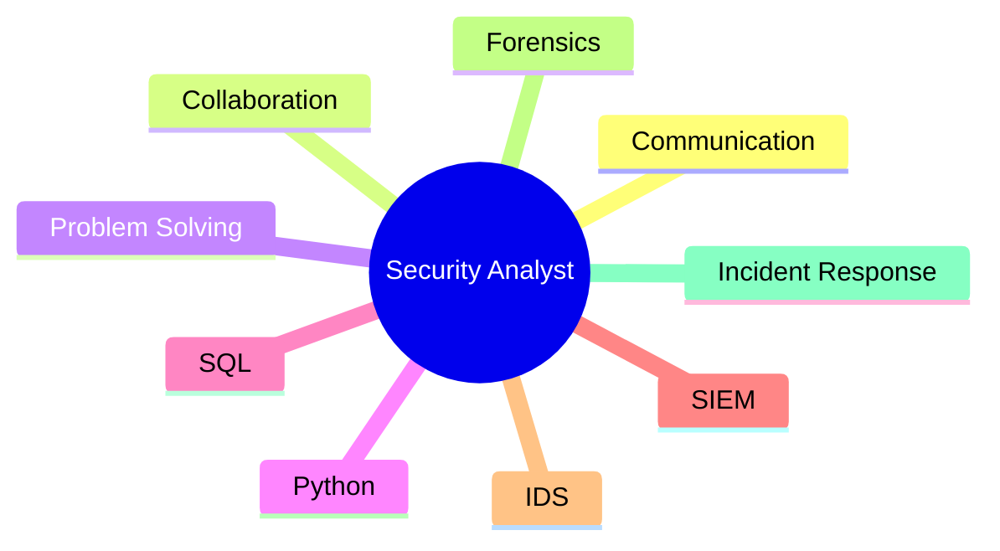

# 🛡️ Module 1: Understanding Cybersecurity

> [!NOTE]
> **Learning Objective**
>
> Understand cybersecurity fundamentals, the role of security analysts, key concepts, and essential technical & transferable skills.

---

# 📚 Table of Contents

- [What is Cybersecurity?](#-what-is-cybersecurity)
- [CIA Triad](#-cia-triad)
- [Importance of Cybersecurity](#-importance-of-cybersecurity)
- [Role of Security Teams](#-role-of-security-teams)
- [Key Cybersecurity Concepts](#-key-cybersecurity-concepts)
- [Types of Security](#-types-of-security)
- [Skills for Security Analysts](#-skills-for-security-analysts)
- [Important Terms](#-important-terms)
- [Quick Revision](#-quick-revision)

---

# 🔐 What is Cybersecurity?

> **Cybersecurity** is the practice of protecting **networks, devices, applications, people, and data** from unauthorized access, cyberattacks, and criminal exploitation.

### 🎯 Primary Goals

- 🔒 Protect information
- 🚫 Prevent unauthorized access
- 💼 Ensure business continuity
- 📜 Maintain regulatory compliance
- 🤝 Preserve customer trust

---

# 🔺 CIA Triad

The **CIA Triad** is the foundation of cybersecurity.

| Principle | Meaning | Example |
|-----------|---------|----------|
| 🔒 **Confidentiality** | Only authorized users can access data | Passwords, Encryption |
| ✅ **Integrity** | Data remains accurate and unchanged | Hashing, Digital Signatures |
| ⚡ **Availability** | Systems remain accessible when needed | Backups, Redundancy |

> [!TIP]
> **Remember:** **CIA = Confidentiality + Integrity + Availability**

---

# 🌍 Why Cybersecurity Matters

Cybersecurity protects an organization's:

- 💰 Financial assets
- 📂 Sensitive information
- 🌐 Network infrastructure
- 👥 Customers
- 🏢 Reputation

### Benefits

- ✅ Prevents data breaches
- ✅ Builds customer trust
- ✅ Reduces financial loss
- ✅ Meets legal requirements
- ✅ Improves business continuity

---

# 👨‍💻 Role of Security Teams

Security teams perform four major tasks.

## 📡 1. Monitor Systems

- Review logs
- Monitor network traffic
- Detect suspicious activities
- Investigate alerts

---

## 🛡️ 2. Prevent Threats

- Install security controls
- Perform vulnerability assessments
- Conduct penetration testing
- Work with developers to build secure applications

---

## 📋 3. Perform Security Audits

Review:

- User permissions
- Password policies
- Security logs
- Compliance requirements

---

## 🚨 4. Incident Response

When attacks occur:

1. Detect
2. Investigate
3. Contain
4. Eradicate
5. Recover
6. Document lessons learned

---

# 📖 Key Cybersecurity Concepts

| Concept | Description |
|----------|-------------|
| 📜 Compliance | Following security laws and regulations |
| 🏗️ Security Framework | Guidelines for managing cybersecurity |
| 🛡️ Security Controls | Safeguards that reduce risks |
| 📈 Security Posture | Overall security readiness |
| 🎭 Threat Actor | Person or group causing cyber risk |
| ⚠️ Threat | Any event that can cause harm |

---

# ☁️ Types of Security

## 🌐 Network Security

Protects:

- Routers
- Switches
- Servers
- Network traffic
- Connected devices

---

## ☁️ Cloud Security

Protects:

- Cloud applications
- Cloud storage
- Virtual machines
- Cloud infrastructure

---

# 💻 Programming in Cybersecurity

Programming helps automate repetitive security tasks.

### Common Languages

| Language | Usage |
|-----------|-------|
| 🐍 Python | Automation & scripting |
| 🗄️ SQL | Database analysis |

Applications:

- Analyze logs
- Search malicious domains
- Automate reports
- Detect suspicious activity

---

# 🧠 Skills for Security Analysts

## 🤝 Transferable Skills

- 💬 Communication
- 🤝 Collaboration
- 🧩 Problem Solving
- ⏰ Time Management
- 📚 Growth Mindset
- 🌎 Diverse Perspectives

---

## ⚙️ Technical Skills

| Skill | Purpose |
|--------|----------|
| 🐍 Programming | Automation |
| 📊 SIEM | Log monitoring |
| 🚨 IDS | Detect intrusions |
| 🔍 Threat Intelligence | Stay updated on attacks |
| 💾 Digital Forensics | Investigate incidents |
| 🚑 Incident Response | Respond to attacks |

---

# 💼 Career Opportunities

After learning cybersecurity fundamentals, you can pursue roles such as:

- 🛡️ Security Analyst
- 💻 Cybersecurity Analyst
- 🖥️ SOC Analyst
- 🔐 Information Security Analyst

---

# 📚 Important Terms

| Term | Meaning |
|------|---------|
| Cybersecurity | Protecting systems and information |
| Threat | Event that causes harm |
| Threat Actor | Person or group creating cyber risk |
| Internal Threat | Insider posing security risk |
| PII | Personally Identifiable Information |
| SPII | Sensitive Personally Identifiable Information |
| Security Controls | Measures that reduce risk |
| Security Posture | Overall security strength |

---

# 📝 Quick Revision

## 🎯 Remember

| Topic | Key Point |
|--------|-----------|
| CIA | Confidentiality, Integrity, Availability |
| Threat Actor | Causes cyber risk |
| SIEM | Collects & analyzes logs |
| IDS | Detects intrusions |
| Compliance | Follow regulations |
| Security Controls | Reduce risks |
| Cloud Security | Protect cloud assets |
| Network Security | Protect networks |

> [!IMPORTANT]
> **Exam Memory Tricks**
>
> - 🔺 **CIA** → Confidentiality • Integrity • Availability
> - 📊 **SIEM** → Collects **Logs**
> - 🚨 **IDS** → Detects **Intrusions**
> - 🔒 **Controls** → Reduce **Risk**
> - ☁️ **Cloud Security** → Protects cloud resources
> - 🌐 **Network Security** → Protects network infrastructure
