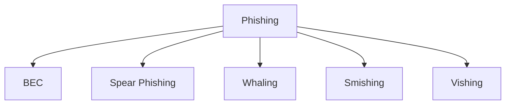
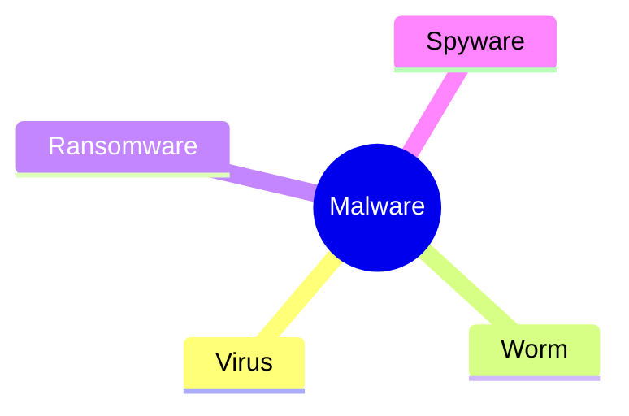

# 🛡️ Module 2: Cyber Attacks

> [!NOTE]
> **Goal:** Learn the most common cyber attacks, how they work, and where they fit in the CISSP Security Domains.

---

## 📑 Table of Contents

- [Phishing](#-phishing)
- [Malware](#-malware)
- [Social Engineering](#-social-engineering)
- [Other Attack Types](#-other-attack-types)
- [CISSP Domain Mapping](#-cissp-domain-mapping)
- [Quick Revision](#-quick-revision)

---

# 🎣 Phishing

> [!IMPORTANT]
> **Phishing** uses digital communication to trick users into revealing sensitive information or installing malware.

## Types

| Attack | Description | Target |
|---------|-------------|--------|
| 🎯 **Spear Phishing** | Personalized phishing | Specific user |
| 👔 **Whaling** | Executive-focused spear phishing | CEO, CFO |
| 📧 **BEC** | Fake business email | Employees |
| 📱 **Smishing** | SMS phishing | Mobile users |
| ☎️ **Vishing** | Voice phishing | Phone users |

---

# 🦠 Malware

> [!TIP]
> Malware = **Malicious Software**

| Type | Needs User Action? | Main Purpose |
|------|------------------|--------------|
| 🦠 Virus | ✅ Yes | Infect files |
| 🪱 Worm | ❌ No | Self-spread |
| 🔒 Ransomware | Sometimes | Encrypt files |
| 👀 Spyware | Usually | Steal information |

---

# 🎭 Social Engineering

> [!WARNING]
> Social engineering attacks **people**, not computers.

## Common Attacks

- 📱 Social Media Phishing
- 💧 Watering Hole Attack
- 🔌 USB Baiting
- 🚪 Physical Social Engineering

### Principles Used

- 👮 Authority
- 😨 Intimidation
- 👥 Social Proof
- ⏳ Scarcity
- ❤️ Familiarity
- 🤝 Trust
- 🚨 Urgency

---

# 🧠 Quick Revision

## Remember

| Attack | Key Point |
|---------|-----------|
| Virus | Needs user action |
| Worm | Self-spreads |
| Spyware | Steals data |
| Ransomware | Encrypts files |
| Spear Phishing | Targets one person |
| Whaling | Targets executives |
| Smishing | SMS |
| Vishing | Phone |

---

## ✅ Exam Tips

> [!TIP]
>
> - **Virus → User action**
> - **Worm → Automatic spread**
> - **Spyware → Secret monitoring**
> - **Ransomware → Encryption**
> - **Whaling → Executives**
> - **Smishing → SMS**
> - **Vishing → Voice Call**
