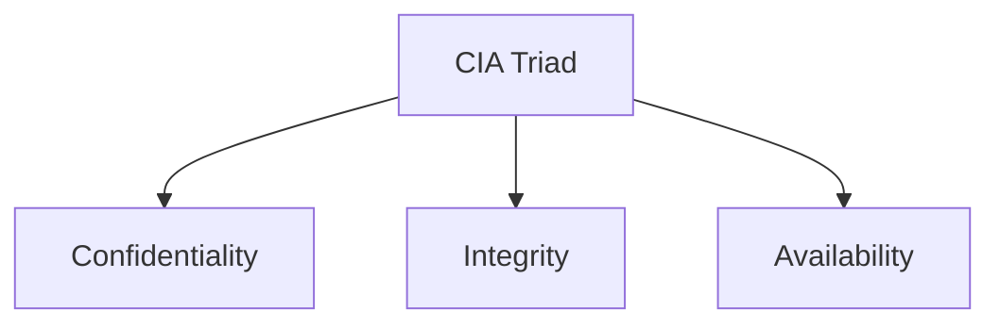

# Module 3: Controls, Frameworks & Compliance

## 📖 Overview

Organizations use **security controls**, **frameworks**, and **compliance standards** together to reduce cybersecurity risks and protect information.

---

# 🔺 CIA Triad

The **Confidentiality, Integrity, and Availability (CIA) Triad** is a foundational security model used to assess risks and design security policies.



| Principle | Description |
|-----------|-------------|
| **Confidentiality** | Only authorized users can access data. |
| **Integrity** | Data remains accurate, authentic, and reliable. |
| **Availability** | Authorized users can access data whenever needed. |

---

# 🛡️ Security Controls

Security controls are **safeguards that reduce security risks**.

They are used alongside security frameworks to implement security goals and meet compliance requirements.

---

# 📋 Security Frameworks

Security frameworks provide guidelines for managing cybersecurity risks.

### Core Components

- Identify and document security goals
- Set guidelines to achieve those goals
- Implement security processes
- Monitor and communicate results

---

# ✅ Compliance

Compliance is the process of following:

- Internal standards
- External regulations

Greater compliance generally leads to lower organizational risk.

---

# 🏛️ Common Frameworks & Compliance Standards

| Standard | Purpose |
|----------|---------|
| **NIST CSF** | Voluntary framework for managing cybersecurity risk. |
| **NIST RMF** | Framework for managing organizational risk. |
| **FERC-NERC** | Protects the North American power grid through CIP standards. |
| **FedRAMP** | Standardizes security assessment and monitoring for U.S. government cloud services. |
| **CIS Controls** | Actionable security controls to strengthen system defense. |
| **GDPR** | Protects the personal data and privacy of EU residents. Requires breach notification within **72 hours**. |
| **PCI DSS** | Protects credit card information during storage, processing, and transmission. |
| **HIPAA** | U.S. law protecting patients' Protected Health Information (PHI). Includes Privacy, Security, and Breach Notification Rules. |
| **HITRUST** | Security framework that helps organizations meet HIPAA compliance. |
| **ISO** | International standards for technology, management, and security processes. |
| **SOC 1 & SOC 2** | Audit reports assessing access controls, security, confidentiality, privacy, and organizational risk. |

---

# ⚖️ Counterattacks

## United States

Counterattacks ("hack back") are generally **illegal** for private organizations due to laws such as:

- Computer Fraud and Abuse Act (1986)
- Cybersecurity Information Sharing Act (2015)

Organizations are expected to **defend**, not retaliate.

Reasons:

- May escalate attacks
- Difficult to identify the real attacker
- Can create international consequences
- Considered vigilantism

Only authorized government or military personnel may conduct offensive cyber operations.

---

## International Perspective

According to guidance from the **International Court of Justice (ICJ)**, a counterattack should:

- Affect only the original attacker
- Request the attacker to stop
- Avoid escalation
- Be reversible

Because these conditions are difficult to guarantee, organizations generally avoid counterattacks.

---

# 🤝 Security Ethics

Security professionals should:

- Respect confidentiality
- Protect privacy
- Follow laws
- Act honestly and responsibly
- Base decisions on evidence
- Continue improving their cybersecurity skills

---

# 🔒 Privacy Protection

Privacy protection safeguards personal information from unauthorized use.

### Personally Identifiable Information (PII)

Information that can identify an individual.

Examples:

- Name
- Phone number

### Sensitive Personally Identifiable Information (SPII)

More sensitive PII requiring stricter protection.

Examples:

- Social Security Number
- Credit Card Number

### Protected Health Information (PHI)

Health-related information protected under HIPAA.

Examples:

- Medical history
- Treatment information
- Healthcare payments

---

# 📝 Key Takeaways

- The **CIA Triad** guides security decisions.
- **Security controls** reduce risks.
- **Security frameworks** provide structured guidance.
- **Compliance** ensures organizations follow required standards and regulations.
- Frameworks such as **NIST CSF**, **RMF**, **CIS**, **FedRAMP**, **ISO**, and **HITRUST** support security programs.
- Regulations including **GDPR**, **HIPAA**, **PCI DSS**, and **FERC-NERC** protect specific industries and data.
- Security professionals have ethical responsibilities to protect data, respect privacy, and comply with laws.

---

# 📚 Important Terms

| Term | Definition |
|------|------------|
| Asset | An item of value to an organization. |
| Compliance | Following internal standards and external regulations. |
| CIA Triad | Confidentiality, Integrity, Availability security model. |
| Security Controls | Safeguards that reduce risks. |
| Security Framework | Guidelines for managing security risks. |
| Security Governance | Practices that define and direct organizational security. |
| Security Architecture | Design of security tools and processes. |
| PHI | Protected Health Information. |
| PII | Personally Identifiable Information. |
| SPII | Sensitive Personally Identifiable Information. |
| Hacktivist | A person who hacks to achieve political or social goals. |
````
