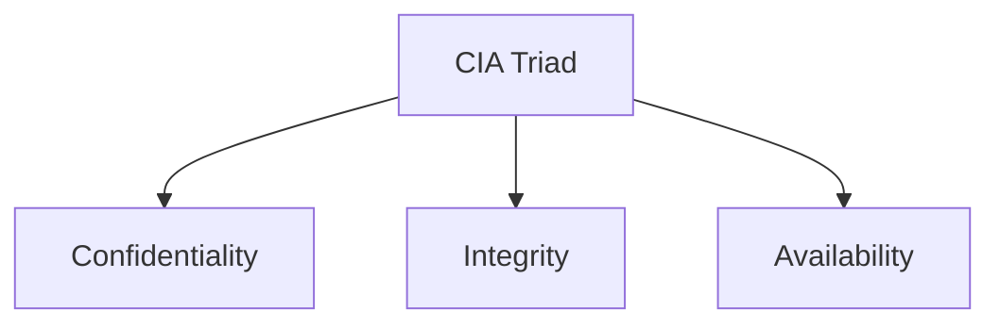
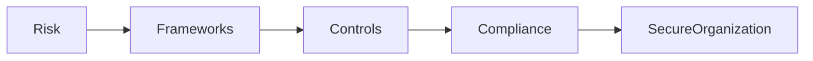
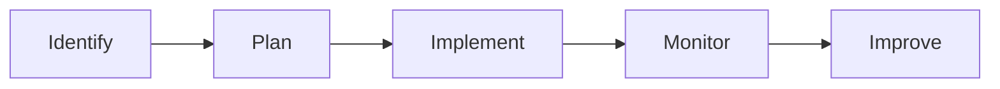
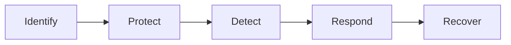
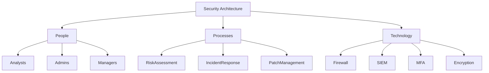
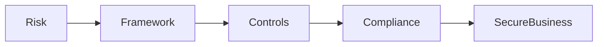
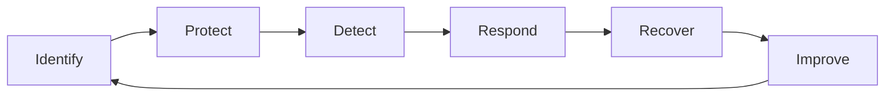

# 🛡️ Google Cybersecurity Professional Certificate
# Module 3 - Controls, Frameworks, Compliance & Security Ethics

> **Course 1 - Foundations of Cybersecurity**
>
> Learn how organizations use **security controls**, **frameworks**, **compliance standards**, and **ethical principles** to protect their assets while ensuring confidentiality, integrity, and availability (CIA).

---

# 📑 Table of Contents

- [Learning Objectives](#learning-objectives)
- [CIA Triad](#cia-triad)
- [Relationship Between Controls, Frameworks & Compliance](#relationship-between-controls-frameworks--compliance)
- [Security Controls](#security-controls)
- [Security Frameworks](#security-frameworks)
- [NIST Cybersecurity Framework (CSF)](#nist-cybersecurity-framework-csf)
- [NIST Risk Management Framework (RMF)](#nist-risk-management-framework-rmf)
- [Module Summary](#module-summary)

---

# 🎯 Learning Objectives

After completing this module, you should be able to:

- Explain the CIA Triad
- Understand security controls
- Understand security frameworks
- Explain compliance
- Identify common cybersecurity frameworks
- Understand how ethics affect cybersecurity
- Learn why counterattacks are discouraged
- Recognize important cybersecurity laws

---

# CIA Triad

The **Confidentiality, Integrity, Availability (CIA) Triad** is one of the most fundamental cybersecurity models.

It helps organizations determine:

- What needs protection
- How systems should be secured
- Which security controls should be implemented
- How risks should be managed

---

## CIA Triangle



---

## Confidentiality

> Only **authorized users** should have access to sensitive information.

### Goal

Prevent unauthorized disclosure.

### Examples

- Password protection
- Multi-Factor Authentication (MFA)
- Encryption
- Role-Based Access Control (RBAC)
- VPNs

### Real Example

Only HR staff should access employee salary information.

---

## Integrity

Integrity ensures that data remains:

- Accurate
- Authentic
- Reliable
- Untampered

### Goal

Prevent unauthorized modification.

### Examples

- Hashing
- Checksums
- Digital Signatures
- File Permissions
- Version Control

### Real Example

A bank balance should never change without an authorized transaction.

---

## Availability

Availability ensures systems and information remain accessible whenever authorized users need them.

### Goal

Prevent downtime.

### Examples

- Backups
- Redundant Servers
- UPS
- Disaster Recovery
- Cloud Replication
- Load Balancers

### Real Example

An online banking website should remain available 24/7.

---

# CIA Triad Summary

| Principle | Protects Against | Examples |
|------------|-----------------|----------|
| Confidentiality | Unauthorized access | Encryption, MFA |
| Integrity | Unauthorized modification | Hashing, Checksums |
| Availability | Downtime | Backups, Redundancy |

---

# Why is the CIA Triad Important?

Every cybersecurity decision should support one or more of these goals.

Examples:

- Encrypting files → Confidentiality
- Verifying file hashes → Integrity
- Maintaining backups → Availability

---

# Relationship Between Controls, Frameworks & Compliance

These three concepts work together to improve organizational security.



---

## Simple Explanation

### Security Controls

Controls are **specific safeguards** used to reduce security risks.

Examples:

- Firewalls
- Antivirus
- MFA
- Encryption
- IDS/IPS

---

### Security Frameworks

Frameworks provide organizations with a structured plan for implementing cybersecurity.

They answer questions like:

- What should we protect?
- How should we protect it?
- How do we measure success?

---

### Compliance

Compliance ensures an organization follows:

- Laws
- Regulations
- Industry Standards
- Internal Policies

---

# Quick Comparison

| Security Controls | Security Frameworks | Compliance |
|-------------------|--------------------|------------|
| Specific safeguards | Strategic guidance | Legal or regulatory adherence |
| Reduce risks | Build security programs | Meet required standards |
| Firewalls, MFA | NIST CSF | HIPAA, GDPR |

---

# Security Controls

Security controls are safeguards that reduce threats, vulnerabilities, and risks.

---

## Types of Security Controls

### Administrative Controls

Policies and procedures.

Examples:

- Security Awareness Training
- Password Policies
- Background Checks
- Incident Response Plans

---

### Technical Controls

Technology-based protections.

Examples:

- Firewalls
- Antivirus
- MFA
- IDS/IPS
- Encryption

---

### Physical Controls

Protect physical assets.

Examples:

- Security Guards
- CCTV
- Locked Doors
- Biometric Access
- Badge Systems

---

## Why Controls Matter

Controls help organizations:

- Reduce attacks
- Prevent unauthorized access
- Detect incidents
- Recover quickly
- Meet compliance requirements

---

# Security Frameworks

Frameworks provide best practices for building cybersecurity programs.

Every framework generally includes four major components.

1. Identify security goals
2. Develop guidelines
3. Implement security processes
4. Monitor and improve



---

# NIST Cybersecurity Framework (CSF)

One of the world's most widely adopted cybersecurity frameworks.

Developed by:

**National Institute of Standards and Technology (NIST)**

Originally created for U.S. critical infrastructure but now used worldwide.

---

## NIST CSF Functions



### 1. Identify

Understand:

- Assets
- Risks
- Business Environment
- Governance

---

### 2. Protect

Implement safeguards.

Examples:

- Access Control
- Encryption
- Security Awareness
- Data Protection

---

### 3. Detect

Identify security events.

Examples:

- Monitoring
- IDS
- Log Analysis

---

### 4. Respond

Contain incidents.

Examples:

- Incident Response
- Communication
- Analysis
- Mitigation

---

### 5. Recover

Restore operations.

Examples:

- Disaster Recovery
- System Restoration
- Lessons Learned

---

# NIST CSF Benefits

✅ Flexible

✅ Cost Effective

✅ Risk-Based

✅ Industry Standard

✅ Improves Security Maturity

---

# NIST Risk Management Framework (RMF)

The RMF provides a structured process for managing cybersecurity risks.

Unlike the CSF, RMF focuses on **risk management throughout a system's lifecycle**.

High-level RMF Steps:

1. Prepare
2. Categorize
3. Select Controls
4. Implement Controls
5. Assess Controls
6. Authorize System
7. Monitor Continuously

---

# Module Summary (Part 1)

✔ CIA Triad

✔ Security Controls

✔ Frameworks

✔ NIST CSF

✔ NIST RMF


---

# 🌐 Major Security Frameworks & Compliance Standards

Organizations around the world follow various **security frameworks**, **regulations**, and **compliance standards** depending on their industry.

> 💡 **Remember:**
>
> - **Frameworks** → Provide guidance and best practices.
> - **Compliance** → Ensures legal and regulatory requirements are met.
> - **Controls** → Technical, administrative, and physical safeguards used to implement frameworks and achieve compliance.

---

# 🏛️ Federal Energy Regulatory Commission (FERC) & NERC

## What is FERC?

The **Federal Energy Regulatory Commission (FERC)** regulates the U.S. energy sector.

It works closely with:

- North American Electric Reliability Corporation (**NERC**)

Together they help protect the North American power grid.

---

## Critical Infrastructure Protection (CIP)

Organizations operating the power grid must comply with **Critical Infrastructure Protection (CIP)** standards.

### Objectives

- Protect critical infrastructure
- Prevent cyber attacks
- Improve resilience
- Report security incidents
- Maintain operational reliability

---

### Organizations Covered

- Power generation companies
- Electricity transmission operators
- Utility companies
- Grid operators

---

### Example

If malware infects a power station,

The organization must:

- Detect the attack
- Contain it
- Report it
- Recover operations
- Prevent future incidents

---

# ☁️ FedRAMP

## Federal Risk and Authorization Management Program

FedRAMP standardizes cloud security for the U.S. Federal Government.

---

## Purpose

Ensure cloud providers meet consistent security requirements before federal agencies can use their services.

---

## Key Features

- Standardized assessments
- Security authorization
- Continuous monitoring
- Risk management
- Cloud compliance

---

## Used By

- Government agencies
- Cloud Service Providers (CSPs)

Examples include cloud platforms serving U.S. federal customers.

---

# 🛡️ Center for Internet Security (CIS)

The **Center for Internet Security (CIS)** is a nonprofit organization that develops practical cybersecurity best practices.

---

## CIS Controls

The CIS Controls are prioritized security actions that help organizations defend against common cyber threats.

Examples include:

- Inventory of assets
- Secure configuration
- Vulnerability management
- Controlled use of administrative privileges
- Audit logging
- Malware defenses
- Data recovery

---

## Benefits

✅ Easy to implement

✅ Practical

✅ Prioritized

✅ Widely recognized

---

# 🇪🇺 General Data Protection Regulation (GDPR)

The **GDPR** protects the personal data and privacy of individuals in the European Union (EU).

It applies even to organizations outside Europe if they process EU residents' data.

---

## GDPR Principles

Organizations must:

- Process data lawfully
- Be transparent
- Collect only necessary data
- Keep data accurate
- Protect stored information
- Delete unnecessary information

---

## User Rights

EU citizens have the right to:

- Access personal data
- Correct inaccurate information
- Delete personal information
- Restrict processing
- Transfer personal data
- Object to processing

---

## Data Breach Rule

Organizations must notify authorities and affected individuals **within 72 hours** after discovering a qualifying data breach.

---

## Example

An online shopping website stores customer information.

If customer records are stolen,

The company must:

- Investigate
- Notify authorities
- Inform affected users
- Reduce further damage

---

# 💳 PCI DSS

## Payment Card Industry Data Security Standard

PCI DSS protects credit card information.

It applies to organizations that:

- Store
- Process
- Accept
- Transmit

payment card data.

---

## Main Objectives

- Build secure networks
- Protect cardholder data
- Encrypt transmissions
- Restrict access
- Monitor systems
- Test security
- Maintain policies

---

## Organizations Covered

- Banks
- Payment gateways
- Retail stores
- E-commerce companies

---

## Example

When purchasing products online,

Your card information should be encrypted before transmission.

---

# 🏥 HIPAA

## Health Insurance Portability and Accountability Act

HIPAA is a U.S. federal law protecting patients' health information.

---

## Purpose

Protect **Protected Health Information (PHI).**

---

## HIPAA Rules

### Privacy Rule

Protects patient privacy.

---

### Security Rule

Protects electronic health information.

---

### Breach Notification Rule

Organizations must notify affected individuals after qualifying breaches.

---

## Protected Health Information (PHI)

Examples include:

- Medical history
- Diagnoses
- Prescriptions
- Insurance information
- Lab reports
- Treatment plans

---

## Why HIPAA Matters

Failure to protect PHI can lead to:

- Identity theft
- Insurance fraud
- Legal penalties
- Financial loss
- Reputation damage

---

# 🏥 HITRUST

HITRUST is a security framework that helps healthcare organizations demonstrate HIPAA compliance.

It combines requirements from multiple standards including:

- HIPAA
- ISO
- NIST
- PCI DSS

---

## Benefits

- Simplifies compliance
- Improves security posture
- Standardizes assessments

---

# 🌍 International Organization for Standardization (ISO)

ISO develops internationally recognized standards across many industries.

---

## ISO 27001

The most well-known cybersecurity standard.

It defines requirements for an Information Security Management System (ISMS).

---

## Goals

- Risk management
- Continuous improvement
- Information security
- Business continuity

---

## Benefits

- Global recognition
- Improved customer trust
- Better governance
- Stronger security

---

# 📋 System and Organization Controls (SOC)

Developed by the **American Institute of Certified Public Accountants (AICPA).**

SOC reports evaluate how organizations protect customer data.

---

# SOC 1

Focuses on:

Financial reporting controls.

Typically requested by financial institutions.

---

# SOC 2

Focuses on:

- Security
- Availability
- Confidentiality
- Privacy
- Processing Integrity

SOC 2 reports are common among:

- SaaS companies
- Cloud providers
- Technology vendors

---

# 📊 Framework Comparison

| Framework | Type | Main Purpose |
|------------|------|--------------|
| NIST CSF | Framework | Cybersecurity best practices |
| NIST RMF | Framework | Risk management lifecycle |
| CIS Controls | Controls Framework | Prioritized security controls |
| FERC-NERC | Regulation | Protect power infrastructure |
| FedRAMP | Government Program | Secure cloud services |
| GDPR | Law | Protect EU personal data |
| PCI DSS | Compliance Standard | Secure payment card data |
| HIPAA | Federal Law | Protect healthcare information |
| HITRUST | Framework | Healthcare security assurance |
| ISO 27001 | International Standard | Information Security Management |
| SOC 1 | Audit Report | Financial controls |
| SOC 2 | Audit Report | Security and privacy controls |

---

# 📚 Quick Memory Table

| Acronym | Remember It As |
|----------|----------------|
| CSF | Cybersecurity Framework |
| RMF | Risk Management Framework |
| CIS | Security Controls |
| GDPR | European Privacy Law |
| PCI DSS | Credit Card Security |
| HIPAA | Healthcare Privacy |
| HITRUST | HIPAA Security Framework |
| ISO | International Standards |
| SOC | Security Audit Reports |
| FedRAMP | Government Cloud Security |
| FERC-NERC | Power Grid Security |

---

# 📝 Exam Tips

> ✅ **NIST CSF** = Five core cybersecurity functions.

> ✅ **RMF** = Risk management lifecycle.

> ✅ **GDPR** = EU privacy law (72-hour breach notification).

> ✅ **HIPAA** = Protects PHI.

> ✅ **PCI DSS** = Credit card security.

> ✅ **FedRAMP** = Government cloud authorization.

> ✅ **SOC 2** = Security, Availability, Confidentiality, Privacy.

> ✅ **ISO 27001** = Global information security standard.


---

# ⚖️ Counterattacks in Cybersecurity

One of the most common misconceptions is that organizations can "hack back" after being attacked.

> 🚨 **Reality:** In most situations, organizations should **defend**, **contain**, **recover**, and **report**—**not counterattack**.

---

# 🛡️ What is a Counterattack?

A **counterattack** (also called **hack back**) is when an individual or organization launches a cyberattack against the original attacker.

Examples include:

- Hacking the attacker's computer
- Deleting attacker files
- Launching malware
- Encrypting attacker systems
- DDoSing the attacker

Although this might sound reasonable, it is usually **illegal** and **highly risky**.

---

# 🇺🇸 United States Position on Counterattacks

In the United States, private organizations and individuals **cannot legally perform cyber counterattacks**.

Instead, they are expected to:

- Detect attacks
- Contain attacks
- Recover systems
- Report incidents
- Work with law enforcement

---

## Why are Counterattacks Illegal?

Several reasons make "hack back" dangerous.

### 1. Attribution is Difficult

You may attack the wrong system.

Example:

An attacker uses someone else's hacked computer.

If you retaliate, you may damage an innocent victim.

---

### 2. Escalation

A counterattack can trigger:

- Larger attacks
- Ransomware retaliation
- Data destruction
- International conflicts

---

### 3. Vigilantism

Law enforcement—not private companies—investigates cybercrime.

Taking offensive action yourself is considered **vigilantism**.

---

### 4. Legal Violations

Counterattacks may violate laws such as:

- Computer Fraud and Abuse Act (CFAA)
- Cybersecurity Information Sharing Act (CISA)

---

# 👤 What is a Vigilante?

A vigilante is someone who attempts to enforce the law without legal authority.

Cybersecurity professionals should **never** become vigilantes.

Instead:

- Collect evidence
- Preserve logs
- Notify management
- Contact authorities

---

# 🏴‍☠️ What is a Hacktivist?

A **hacktivist** is someone who uses hacking techniques to achieve political or social goals.

Their objectives may include:

- Political protest
- Social activism
- Civil disobedience
- Public awareness

Hacktivists are different from ordinary cybercriminals because their motivation is often ideological rather than financial.

---

# 🌍 International Perspective

Some international guidance allows limited countermeasures under very strict conditions.

These principles are discussed in the **Tallinn Manual**.

---

# Tallinn Manual Guidelines

According to international guidance, a response should:

✅ Only affect the original attacker

✅ Ask the attacker to stop

✅ Avoid escalation

✅ Be reversible

---

## Why Organizations Avoid Counterattacks

Even if international guidance exists:

- Attribution is uncertain
- Legal rules differ between countries
- Mistakes can affect innocent systems
- Escalation risks are high

Therefore, most organizations focus on:

- Defense
- Detection
- Recovery
- Law enforcement cooperation

---

# 🧭 Security Ethics

Cybersecurity professionals have ethical responsibilities beyond technical skills.

Ethics help professionals make responsible decisions that protect:

- Organizations
- Customers
- Employees
- Society

---

# Core Ethical Principles

A cybersecurity professional should:

- Be honest
- Act responsibly
- Respect privacy
- Follow laws
- Protect confidential information
- Use evidence
- Avoid bias
- Continue learning

---

# 🤝 Why Ethics Matter

Without ethics, professionals could misuse privileged access.

For example:

❌ Reading employee emails without permission

❌ Selling customer information

❌ Sharing passwords

❌ Accessing confidential files unnecessarily

All of these violate professional ethics.

---

# 🔒 Confidentiality

Confidentiality means:

> Only authorized users can access information.

Examples include:

- Passwords
- Encryption
- Multi-Factor Authentication
- Access Control Lists
- Least Privilege

---

## Ethical Importance

Security professionals often have administrator privileges.

They must **never** misuse those privileges to access sensitive information without authorization.

---

# 🛡️ Privacy Protection

Privacy protection is the process of safeguarding personal information from unauthorized use.

Organizations should:

- Collect only necessary data
- Store it securely
- Limit access
- Delete unnecessary information

---

# 👤 Personally Identifiable Information (PII)

PII is information that can identify an individual.

Examples:

- Full Name
- Phone Number
- Email Address
- Home Address
- Date of Birth

---

# 🔐 Sensitive Personally Identifiable Information (SPII)

SPII is a more sensitive category of PII requiring stronger protection.

Examples include:

- Social Security Number
- Passport Number
- Driver's License Number
- Credit Card Number
- Bank Account Number

If stolen, SPII can directly enable identity theft or financial fraud.

---

# 🏥 Protected Health Information (PHI)

PHI refers to health-related information that identifies an individual.

Examples:

- Medical history
- Prescriptions
- Lab results
- Insurance details
- Treatment records
- Mental health records

PHI is protected under **HIPAA**.

---

# 📊 PII vs SPII vs PHI

| Type | Description | Examples |
|------|-------------|----------|
| PII | Identifies a person | Name, Email, Phone |
| SPII | Highly sensitive PII | SSN, Passport, Credit Card |
| PHI | Healthcare information | Medical Records, Diagnoses |

---

# ⚖️ Laws and Cybersecurity

Laws define what organizations **must** do.

Cybersecurity professionals must ensure their organization complies with applicable regulations.

---

## Responsibilities of Security Professionals

A cybersecurity professional should:

- Protect systems
- Protect customer information
- Follow laws
- Follow company policies
- Preserve evidence
- Report incidents
- Respect privacy
- Maintain confidentiality

---

# 📌 Ethical Decision Making

When making security decisions, always ask:

- Is it legal?
- Is it ethical?
- Does it protect users?
- Does it respect privacy?
- Is there sufficient evidence?

---

# 💡 Best Practices

✔ Follow the principle of least privilege

✔ Protect sensitive data

✔ Use encryption

✔ Maintain audit logs

✔ Report incidents promptly

✔ Never access data without authorization

✔ Continue improving your cybersecurity knowledge

---

# 📝 Exam Tips

> 🚨 Private organizations should **not hack back**.

> 🚨 Cybersecurity professionals protect systems—they do **not** seek revenge.

> 🚨 PII identifies a person.

> 🚨 SPII is highly sensitive PII.

> 🚨 PHI is protected under HIPAA.

> 🚨 Ethics are as important as technical skills.

---

# 📌 Key Takeaways

- Counterattacks are generally illegal and risky.
- Organizations should focus on defense, detection, response, and recovery.
- Ethical behavior is a core responsibility of cybersecurity professionals.
- Confidentiality, privacy, and legal compliance go hand in hand.
- Proper handling of PII, SPII, and PHI protects both organizations and individuals.

---

---

# 🏢 Security Governance

Security governance refers to the **policies, processes, roles, and responsibilities** that guide an organization's cybersecurity efforts.

It ensures that security aligns with business objectives and regulatory requirements.

---

## Goals of Security Governance

- Protect organizational assets
- Manage cybersecurity risks
- Ensure legal compliance
- Define security responsibilities
- Support business continuity
- Improve decision-making

---

## Key Components

| Component | Purpose |
|----------|---------|
| Policies | High-level security rules |
| Standards | Mandatory technical requirements |
| Procedures | Step-by-step instructions |
| Guidelines | Recommended best practices |
| Monitoring | Measure effectiveness |
| Auditing | Verify compliance |

---

## Why Governance Matters

Without governance:

- Security becomes inconsistent.
- Employees may ignore policies.
- Compliance becomes difficult.
- Risks increase.

With governance:

- Roles are clearly defined.
- Risks are managed effectively.
- Compliance is easier to achieve.
- Security becomes part of business strategy.

---

# 🏗️ Security Architecture

Security architecture is the overall design of an organization's security infrastructure.

It combines:

- People
- Processes
- Technologies

to protect information systems.

---

## Components of Security Architecture

### 👥 People

Examples:

- Security Analysts
- System Administrators
- Managers
- Incident Response Teams

---

### ⚙️ Processes

Examples:

- Risk Assessment
- Incident Response
- Change Management
- Patch Management
- Vulnerability Management

---

### 💻 Technology

Examples:

- Firewalls
- Antivirus
- SIEM
- IDS/IPS
- VPN
- MFA
- Encryption

---

## Security Architecture Diagram



---

# 💎 Organizational Assets

An **asset** is anything valuable to an organization.

Assets require protection because they support business operations.

---

## Types of Assets

### Physical Assets

Examples:

- Servers
- Laptops
- Office buildings
- Network equipment

---

### Digital Assets

Examples:

- Databases
- Customer records
- Source code
- Emails
- Cloud storage

---

### Intellectual Property

Examples:

- Patents
- Trade secrets
- Research
- Software

---

### Human Assets

Examples:

- Employees
- Contractors
- Customers

---

# Why Protect Assets?

Attackers target assets because they have value.

Loss of assets may cause:

- Financial loss
- Reputation damage
- Legal penalties
- Service disruption

---

# 🔐 Controls vs Frameworks vs Compliance

One of the most important exam topics.

---

## Security Controls

Controls answer:

> **How do we protect systems?**

Examples:

- Firewall
- MFA
- Encryption
- Antivirus

---

## Security Frameworks

Frameworks answer:

> **How should an organization build its security program?**

Examples:

- NIST CSF
- NIST RMF
- ISO 27001
- CIS Controls

---

## Compliance

Compliance answers:

> **What laws or regulations must we follow?**

Examples:

- HIPAA
- GDPR
- PCI DSS
- FERC-NERC

---

# Relationship Diagram



---

# Comparison Table

| Category | Purpose | Examples |
|----------|----------|----------|
| Controls | Reduce specific risks | Firewall, MFA |
| Framework | Provide guidance | NIST CSF |
| Compliance | Meet legal requirements | HIPAA, GDPR |

---

# CIA Triad and Controls

Every security control supports one or more CIA principles.

| Control | Confidentiality | Integrity | Availability |
|----------|----------------|-----------|--------------|
| Encryption | ✅ | | |
| MFA | ✅ | | |
| Access Control | ✅ | | |
| Hashing | | ✅ | |
| Digital Signature | | ✅ | |
| Backup | | | ✅ |
| Disaster Recovery | | | ✅ |
| Load Balancer | | | ✅ |

---

# Example Mapping

### Encryption

Protects:

✅ Confidentiality

---

### Hashing

Protects:

✅ Integrity

---

### Backup

Protects:

✅ Availability

---

# 🔄 Security Lifecycle

Organizations continuously improve security.



---

# 🧩 Real-World Scenarios

## Scenario 1

A company encrypts employee salary data.

Question:

Which CIA principle?

✅ **Confidentiality**

---

## Scenario 2

An attacker changes bank balances.

Which principle is violated?

✅ **Integrity**

---

## Scenario 3

A hospital server crashes.

Doctors cannot access patient records.

Which principle?

✅ **Availability**

---

## Scenario 4

A retailer stores customer credit card numbers securely.

Which compliance standard applies?

✅ **PCI DSS**

---

## Scenario 5

A hospital stores medical records.

Which law applies?

✅ **HIPAA**

---

## Scenario 6

A company processes data of EU citizens.

Which regulation applies?

✅ **GDPR**

---

## Scenario 7

A cloud provider wants to sell services to U.S. federal agencies.

Which program is required?

✅ **FedRAMP**

---

# 🧠 Memory Tricks (Mnemonics)

### CIA

- **C** → Confidentiality → **Keep Secrets**
- **I** → Integrity → **Keep Correct**
- **A** → Availability → **Keep Accessible**

---

### NIST CSF

Remember:

**I P D R R**

> **I**dentify  
> **P**rotect  
> **D**etect  
> **R**espond  
> **R**ecover

---

### HIPAA

Think:

🏥 **Health**

---

### PCI DSS

Think:

💳 **Payment Cards**

---

### GDPR

Think:

🇪🇺 **Europe**

---

### FedRAMP

Think:

☁️ **Federal Cloud**

---

# 🎯 Practice Questions

### Q1

Which CIA principle ensures data cannot be modified without authorization?

**Answer:** Integrity

---

### Q2

Which framework contains Identify, Protect, Detect, Respond, Recover?

**Answer:** NIST CSF

---

### Q3

Which compliance standard protects credit card data?

**Answer:** PCI DSS

---

### Q4

Which law protects healthcare information?

**Answer:** HIPAA

---

### Q5

Which regulation protects EU citizens' personal data?

**Answer:** GDPR

---

### Q6

What type of information is a Social Security Number?

**Answer:** SPII

---

### Q7

What is an asset?

**Answer:** Anything valuable to an organization.

---

# 📌 Key Takeaways

- Security governance aligns cybersecurity with business goals.
- Security architecture combines people, processes, and technology.
- Assets include physical, digital, intellectual, and human resources.
- Controls implement protection.
- Frameworks provide structure.
- Compliance satisfies legal and regulatory obligations.
- The CIA Triad is the foundation for choosing security controls.

---

---

# 📚 Module 3 Glossary

Below are the key terms introduced in this module.

| Term | Definition |
|------|------------|
| **Asset** | Anything valuable to an organization that requires protection. |
| **Availability** | Ensuring authorized users can access systems and data when needed. |
| **Compliance** | Following internal policies, laws, regulations, and industry standards. |
| **Confidentiality** | Preventing unauthorized access to information. |
| **CIA Triad** | Security model consisting of Confidentiality, Integrity, and Availability. |
| **Framework** | A structured set of guidelines used to build and manage cybersecurity programs. |
| **Security Controls** | Safeguards that reduce risks and protect systems. |
| **Security Governance** | Policies and processes that direct an organization's security strategy. |
| **Security Architecture** | The design of an organization's overall security infrastructure. |
| **Integrity** | Ensuring data remains accurate, authentic, and unaltered. |
| **Privacy Protection** | Safeguarding personal information from unauthorized use. |
| **PII** | Personally Identifiable Information. |
| **SPII** | Sensitive Personally Identifiable Information requiring stronger protection. |
| **PHI** | Protected Health Information governed by HIPAA. |
| **Hacktivist** | A person who uses hacking to promote political or social causes. |
| **NIST CSF** | Cybersecurity Framework developed by NIST. |
| **NIST RMF** | Risk Management Framework developed by NIST. |
| **FedRAMP** | Federal cloud security authorization program. |
| **GDPR** | European data privacy regulation. |
| **HIPAA** | U.S. law protecting healthcare information. |
| **PCI DSS** | Payment Card Industry Data Security Standard. |
| **ISO 27001** | International information security management standard. |
| **SOC 1** | Audit report focused on financial controls. |
| **SOC 2** | Audit report focused on security, privacy, availability, confidentiality, and processing integrity. |

---

# 📄 Quick Revision Sheet

## CIA Triad

| Principle | Goal | Examples |
|-----------|------|----------|
| Confidentiality | Prevent unauthorized access | Encryption, MFA |
| Integrity | Prevent unauthorized modification | Hashing, Digital Signatures |
| Availability | Ensure systems remain accessible | Backups, Redundancy |

---

## Security Controls

Three major categories:

- Administrative Controls
- Technical Controls
- Physical Controls

---

## Security Frameworks

Frameworks provide guidance for building cybersecurity programs.

Examples:

- NIST CSF
- NIST RMF
- ISO 27001
- CIS Controls

---

## Compliance Standards

Examples include:

- HIPAA
- GDPR
- PCI DSS
- FedRAMP
- FERC-NERC

---

# 🧠 Ultimate Comparison Table

| Feature | Controls | Frameworks | Compliance |
|----------|-----------|------------|------------|
| Purpose | Protect systems | Build security programs | Meet legal requirements |
| Focus | Implementation | Strategy | Regulation |
| Examples | Firewall, MFA | NIST CSF | HIPAA |
| Mandatory? | Usually Internal | Usually Voluntary | Often Required |

---

# 🎯 Common Interview Questions

## Beginner

### 1. What is the CIA Triad?

A security model consisting of:

- Confidentiality
- Integrity
- Availability

---

### 2. What is confidentiality?

Ensuring only authorized users can access information.

---

### 3. What is integrity?

Ensuring information remains accurate and unmodified.

---

### 4. What is availability?

Ensuring systems remain accessible to authorized users.

---

### 5. What is an asset?

Anything valuable to an organization.

---

### 6. What is a security control?

A safeguard that reduces cybersecurity risk.

---

### 7. What is a security framework?

A structured set of best practices for managing cybersecurity.

---

### 8. What is compliance?

Following laws, regulations, and organizational policies.

---

### 9. What is HIPAA?

A U.S. law protecting healthcare information.

---

### 10. What is GDPR?

A European regulation protecting personal data.

---

### 11. What is PCI DSS?

A security standard protecting payment card information.

---

### 12. What is FedRAMP?

A federal program standardizing cloud security for U.S. government agencies.

---

### 13. What is ISO 27001?

An international standard for Information Security Management Systems (ISMS).

---

### 14. What is a hacktivist?

Someone who hacks to promote political or social objectives.

---

### 15. Why are cyber counterattacks discouraged?

Because they may:

- Break laws
- Escalate attacks
- Harm innocent parties
- Complicate investigations

---

# 💡 Exam Tips

> ✅ **Confidentiality = Secrets**

> ✅ **Integrity = Accuracy**

> ✅ **Availability = Accessibility**

---

> ✅ **HIPAA = Health**

> ✅ **PCI DSS = Payments**

> ✅ **GDPR = Europe**

> ✅ **FedRAMP = Federal Cloud**

---

> ✅ **Framework = Guidance**

> ✅ **Control = Protection**

> ✅ **Compliance = Legal Requirement**

---

# 📝 Practice Quiz

### Q1

Which CIA principle is protected by encryption?

**Answer:** Confidentiality

---

### Q2

Which CIA principle is protected by hashing?

**Answer:** Integrity

---

### Q3

Which CIA principle is protected by backups?

**Answer:** Availability

---

### Q4

Which framework contains the functions Identify, Protect, Detect, Respond, and Recover?

**Answer:** NIST Cybersecurity Framework (CSF)

---

### Q5

Which law protects medical records?

**Answer:** HIPAA

---

### Q6

Which regulation protects EU residents' personal information?

**Answer:** GDPR

---

### Q7

Which standard secures payment card data?

**Answer:** PCI DSS

---

### Q8

What type of information includes Social Security Numbers?

**Answer:** SPII

---

### Q9

Can private organizations legally "hack back" in the U.S.?

**Answer:** No.

---

### Q10

What are the three categories of security controls?

**Answer:**

- Administrative
- Technical
- Physical

---

# 🎓 Module Summary

By completing Module 3, you should now understand:

- ✅ The CIA Triad and its role in cybersecurity
- ✅ The difference between controls, frameworks, and compliance
- ✅ Major standards such as NIST CSF, RMF, HIPAA, GDPR, PCI DSS, ISO 27001, SOC, and FedRAMP
- ✅ Security governance and security architecture
- ✅ Ethical responsibilities of cybersecurity professionals
- ✅ Privacy concepts including PII, SPII, and PHI
- ✅ Why counterattacks are generally illegal and discouraged
- ✅ How organizations protect assets through governance, controls, and compliance

---

# 🚀 What's Next?

Continue to the next module, where you'll explore:

- Risk Management
- Security Auditing
- Threat Modeling
- Vulnerability Management
- Incident Response
- Security Operations

---

# 📖 Additional Reading

- NIST Cybersecurity Framework
- NIST Risk Management Framework
- CIS Controls
- HIPAA Security Rule
- GDPR Articles
- PCI DSS Requirements
- ISO/IEC 27001
- SOC Reporting Standards

---

# ⭐ Key Takeaways

> **Remember this simple formula:**

```text
Risk
   ↓
Framework
   ↓
Controls
   ↓
Compliance
   ↓
Secure Organization
```

Cybersecurity isn't just about technology—it also involves **people, processes, governance, ethics, and continuous improvement**.

---

<div align="center">


**Happy Learning & Stay Secure! 🔒**

</div>


** Part 2 covers **FedRAMP, CIS Controls, FERC-NERC, GDPR, PCI DSS, HIPAA, ISO, SOC Reports**, and comparison tables.
