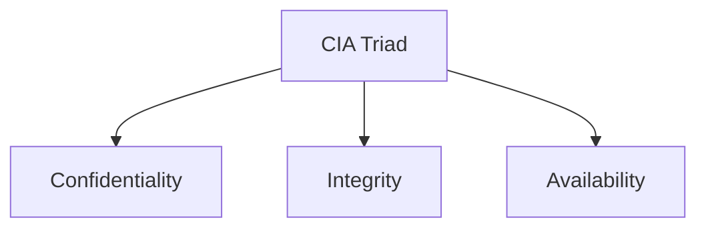

# 🛡️ Course 2 - Module 2: Frameworks, Controls & Security Audits

## 📖 Overview

Organizations use **security frameworks**, **security controls**, and **security audits** together to reduce cybersecurity risks, protect assets, and comply with regulations.

---

# 📋 Security Frameworks

Security frameworks are guidelines used to build security plans that help mitigate risks to data and privacy.

### Purpose

- Reduce security risks
- Protect organizational data
- Support compliance with laws and regulations
- Improve an organization's security posture

> **Example:** Healthcare organizations use frameworks to comply with **HIPAA**.

---

# 🛠️ Security Controls

Security controls are safeguards designed to reduce specific security risks.

They work alongside security frameworks to prevent, detect, or correct security issues.

### Example

Using **Multi-Factor Authentication (MFA)** to access medical records helps protect patient information and supports HIPAA compliance.

---

# 📚 Common Frameworks

## Cyber Threat Framework (CTF)

The **Cyber Threat Framework (CTF)** was developed by the U.S. government to provide a **common language** for describing cyber threat activity.

### Benefits

- Standardizes threat communication
- Improves threat analysis
- Supports information sharing
- Enhances incident response

---

## ISO/IEC 27001

An internationally recognized framework for managing information security.

It provides:

- Information Security Management System (ISMS)
- Best practices
- Risk management guidance
- Recommended security controls

Used to protect assets such as:

- Financial information
- Employee data
- Intellectual property
- Third-party information

> **Note:** ISO/IEC 27001 recommends controls but does **not** require specific ones.

---

# 🛡️ Types of Security Controls

Security controls fall into three categories.

| Control Type | Examples |
|--------------|----------|
| **Physical** | Gates, locks, CCTV, security guards, badges |
| **Technical** | Firewalls, MFA, Antivirus |
| **Administrative** | Separation of duties, Authorization, Asset classification |

---

# 🔺 CIA Triad

The **CIA Triad** is the foundation of cybersecurity and guides how organizations protect information.

---

## Confidentiality

Only **authorized users** should access data.

### Supported by

- Principle of Least Privilege
- Access controls
- MFA

---

## Integrity

Data should remain:

- Accurate
- Authentic
- Reliable

### Methods

- Cryptography
- Encryption

---

## Availability

Authorized users should be able to access data whenever needed.

Example:

- Secure remote access for employees

---

# 🔐 Security Principles (OWASP)

These principles help organizations build secure systems.

## Previously Introduced Principles

| Principle | Purpose |
|-----------|---------|
| **Minimize Attack Surface** | Reduce possible attack points |
| **Least Privilege** | Give only required access |
| **Defense in Depth** | Use multiple security controls |
| **Separation of Duties** | Split critical tasks among multiple people |
| **Keep Security Simple** | Avoid unnecessary complexity |
| **Fix Security Issues Correctly** | Identify root cause and verify remediation |

---

## Additional OWASP Principles

### Establish Secure Defaults

Applications should be secure by default.

Users should have to make extra effort to reduce security.

---

### Fail Securely

If a security control fails, it should default to the safest state.

**Example:** A firewall should block all traffic instead of allowing everything.

---

### Don't Trust Services

Organizations should not automatically trust third-party systems.

Always verify external data before using it.

---

### Avoid Security by Obscurity

Security should not depend on keeping system details secret.

Instead, rely on:

- Strong authentication
- Defense in depth
- Secure architecture
- Proper auditing

---

# 📑 Security Audits

A **security audit** reviews an organization's:

- Security controls
- Policies
- Procedures

to determine whether they meet internal and external requirements.

---

## Goals of a Security Audit

- Evaluate security practices
- Identify weaknesses
- Ensure compliance
- Improve security posture
- Reduce risks

---

## Factors Affecting Audits

Audit requirements depend on:

- Industry
- Organization size
- Government regulations
- Geographic location
- Compliance requirements

---

# Frameworks & Controls in Audits

Frameworks help organizations prepare for audits.

Common examples include:

- NIST CSF
- ISO 27000 Series

Controls reviewed during audits include:

- Administrative
- Technical
- Physical

---

# 📝 Audit Checklist

A typical security audit follows these steps.

## 1. Define Scope

Identify:

- Assets
- Systems
- Security controls
- Policies

---

## 2. Perform Risk Assessment

Evaluate risks related to:

- Budget
- Controls
- Internal processes
- Compliance

---

## 3. Conduct the Audit

Review the identified assets and security controls.

---

## 4. Create a Mitigation Plan

Develop strategies to reduce identified risks.

---

## 5. Communicate Results

Prepare a report including:

- Findings
- Risks
- Recommendations
- Required improvements

---

# 📝 Key Takeaways

- **Security frameworks** provide guidance for managing cybersecurity.
- **Security controls** reduce security risks.
- **CTF** standardizes cyber threat communication.
- **ISO/IEC 27001** provides an internationally recognized security framework.
- Security controls are **Physical**, **Technical**, and **Administrative**.
- The **CIA Triad** consists of Confidentiality, Integrity, and Availability.
- **OWASP principles** promote secure application and system design.
- **Security audits** evaluate security controls, policies, and compliance.
- Audit results help organizations improve their overall security posture.

---

# 📚 Important Terms

| Term | Definition |
|------|------------|
| **Asset** | An item of value to an organization. |
| **Security Framework** | Guidelines for managing cybersecurity risks. |
| **Security Control** | Safeguard that reduces security risks. |
| **Security Posture** | Organization's ability to defend assets and adapt to threats. |
| **CIA Triad** | Confidentiality, Integrity, Availability security model. |
| **Confidentiality** | Only authorized users can access data. |
| **Integrity** | Data remains accurate and authentic. |
| **Availability** | Authorized users can access data when needed. |
| **Authentication** | Verifying a user's identity. |
| **Authorization** | Granting access to resources. |
| **Encryption** | Converting plaintext into encoded data. |
| **Threat** | Any event that can negatively impact assets. |
| **Risk** | Anything affecting confidentiality, integrity, or availability. |
| **Security Audit** | Review of security controls, policies, and procedures. |
| **Attack Vector** | Path used by attackers to exploit systems. |
| **Biometrics** | Physical characteristics used for identity verification. |
| **OWASP** | Organization focused on improving software security. |
| **NIST CSF** | Cybersecurity Framework for managing cybersecurity risk. |
| **NIST SP 800-53** | Security and privacy controls for federal information systems. |
