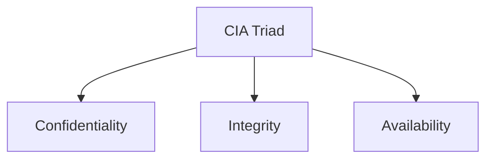
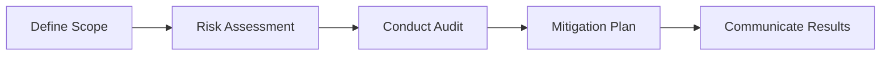

# 🛡️ Course 2 – Module 2: Frameworks, Controls & Security Audits

## 📖 Overview

Security frameworks, controls, and audits work together to protect an organization's assets, reduce cybersecurity risks, and ensure compliance with laws and regulations. This module covers common frameworks, the CIA Triad, OWASP security principles, and the fundamentals of security audits.

---

# 🏗️ Security Frameworks

A **security framework** is a set of guidelines used to build security plans that reduce risks to data, systems, and privacy.

### Purpose

- Build an organization's security program
- Reduce cybersecurity risks
- Support compliance with regulations
- Improve the organization's security posture

> **Example:** Healthcare organizations use security frameworks to help comply with **HIPAA**, protecting patient information.

---

# 🛡️ Security Controls

Security controls are safeguards used to reduce specific security risks.

They work together with frameworks to:

- Prevent attacks
- Detect security issues
- Correct security problems

### Example

Using **Multi-Factor Authentication (MFA)** to access patient medical records helps protect sensitive healthcare information and supports HIPAA compliance.

---

# 📚 Common Security Frameworks

## Cyber Threat Framework (CTF)

The **Cyber Threat Framework (CTF)** was developed by the U.S. government to provide a **common language** for describing cyber threats.

### Benefits

- Standardizes cyber threat terminology
- Improves communication between organizations
- Supports threat analysis
- Improves incident response

---

## ISO/IEC 27001

ISO/IEC 27001 is an internationally recognized framework for managing information security.

It provides guidance for creating an **Information Security Management System (ISMS)**.

### Protects

- Financial information
- Intellectual property
- Employee records
- Third-party information

### Provides

- Security best practices
- Risk management guidance
- Recommended security controls

> **Note:** ISO/IEC 27001 recommends controls but does **not** require organizations to implement specific controls.

---

# 🛠️ Security Controls

Security controls can be divided into three categories.

## Physical Controls

Protect physical assets.

Examples:

- Gates
- Fences
- Locks
- Security guards
- CCTV cameras
- Motion detectors
- Access cards
- Badges

---

## Technical Controls

Protect systems using technology.

Examples:

- Firewalls
- Multi-Factor Authentication (MFA)
- Antivirus software

---

## Administrative Controls

Protect organizations through policies and procedures.

Examples:

- Separation of duties
- Authorization
- Asset classification

---

# 🔺 CIA Triad

The **Confidentiality, Integrity, and Availability (CIA) Triad** is the foundation of cybersecurity.

It helps organizations design secure systems and maintain an effective security posture.

---

# 🔒 Confidentiality

Confidentiality ensures that **only authorized users** can access data.

### Common Methods

- Authentication
- Authorization
- Principle of Least Privilege
- MFA
- Access controls

### Example

An employee in Accounting can access payroll records but cannot access software development files.

---

# ✅ Integrity

Integrity ensures that information remains:

- Accurate
- Authentic
- Reliable
- Unmodified

### Methods for Maintaining Integrity

- Cryptography
- Encryption
- Data validation
- Integrity checks

### Encryption

Encryption converts **plaintext** into **ciphertext**, helping prevent unauthorized modification or access.

---

# 🌐 Availability

Availability ensures that authorized users can access data whenever needed.

Examples include:

- Reliable systems
- Network availability
- Secure remote access
- Backup systems

Availability and confidentiality work together to provide secure access without exposing sensitive information.

---

# ⚙️ OWASP Security Principles

The **Open Worldwide Application Security Project (OWASP)** provides security principles that help organizations build secure systems.

---

## 1. Minimize Attack Surface

Reduce the number of possible entry points attackers can exploit.

---

## 2. Principle of Least Privilege

Users should receive only the permissions required to perform their job.

---

## 3. Defense in Depth

Implement multiple layers of security controls instead of relying on a single defense.

Examples include:

- Firewalls
- MFA
- Antivirus
- IDS
- Encryption

---

## 4. Separation of Duties

Critical operations should require multiple authorized individuals.

This reduces the risk of fraud or misuse.

---

## 5. Keep Security Simple

Avoid unnecessary complexity.

Simple security solutions are easier to manage, understand, and maintain.

---

## 6. Fix Security Issues Correctly

When a vulnerability is discovered:

1. Identify the root cause.
2. Contain the issue.
3. Remove the vulnerability.
4. Verify the fix through testing.

---

# Additional OWASP Principles

## Establish Secure Defaults

Applications should be secure immediately after installation.

Users should have to intentionally reduce security rather than increase it.

---

## Fail Securely

If a security control fails, it should fail in the safest possible state.

### Example

If a firewall crashes, it should block all traffic instead of allowing unrestricted access.

---

## Don't Trust Services

Organizations should never assume third-party systems are secure.

Always verify data received from external partners before trusting it.

---

## Avoid Security by Obscurity

Security should **not** depend on hiding implementation details.

Instead, organizations should rely on:

- Strong authentication
- Encryption
- Defense in depth
- Secure architecture
- Auditing
- Monitoring

---

# 📝 Part 1 Summary

In this section, you learned:

- Security frameworks provide guidance for managing cybersecurity.
- Security controls reduce risks and support compliance.
- CTF standardizes cyber threat communication.
- ISO/IEC 27001 provides international information security guidance.
- Security controls are Physical, Technical, and Administrative.
- The CIA Triad consists of Confidentiality, Integrity, and Availability.
- OWASP security principles help organizations build secure systems.

  ---

# 🔍 Security Audits

A **security audit** is an independent review of an organization's **security controls, policies, and procedures** to determine whether they meet internal standards and external compliance requirements.

Audits help organizations:

- Evaluate existing security measures
- Identify threats, risks, and vulnerabilities
- Verify compliance with laws and regulations
- Improve their overall security posture

> **Note:** Regular audits help organizations avoid penalties, fines, and security incidents.

---

# 🎯 Goals & Objectives of a Security Audit

### Goal

Ensure an organization's **Information Technology (IT)** practices meet industry standards and organizational requirements.

### Objectives

- Identify security weaknesses
- Verify security controls
- Ensure compliance with regulations
- Recommend improvements
- Reduce organizational risk
- Maintain business continuity

---

# 📌 Factors That Affect Audits

The type and frequency of audits depend on several factors:

- Industry
- Organization size
- Government regulations
- Geographic location
- Regulatory compliance requirements
- Organizational policies

---

# 🏗️ Frameworks & Controls in Audits

Security frameworks help organizations prepare for audits and improve compliance.

Common frameworks include:

- **NIST Cybersecurity Framework (CSF)**
- **ISO 27000 Series**

Frameworks work together with security controls to reduce risk and demonstrate compliance.

---

# 🛠️ Categories of Security Controls Reviewed

During an audit, three categories of controls are commonly evaluated.

| Category | Purpose | Examples |
|----------|---------|----------|
| **Administrative** | Policies and procedures | Authorization, Separation of Duties, Asset Classification |
| **Technical** | Technology-based protection | Firewalls, MFA, Antivirus |
| **Physical** | Physical protection of assets | Locks, CCTV, Security Guards |

---

# 📋 Audit Checklist

A security audit generally follows five major steps.

---

## 1️⃣ Define the Audit Scope

Identify:

- Assets to assess
- Systems to review
- Security controls
- Organizational goals
- Audit frequency
- Policies and procedures

Examples of assets:

- Firewalls
- Servers
- Workstations
- PII
- Physical assets

---

## 2️⃣ Perform a Risk Assessment

Evaluate organizational risks related to:

- Budget
- Security controls
- Internal processes
- Compliance requirements
- External regulations

The goal is to identify areas needing improvement before conducting the audit.

---

## 3️⃣ Conduct the Audit

Review the security of all identified assets.

Activities may include:

- Reviewing configurations
- Checking permissions
- Examining security controls
- Validating compliance
- Identifying vulnerabilities

---

## 4️⃣ Create a Mitigation Plan

Develop strategies to reduce identified risks.

A mitigation plan should:

- Lower risk
- Improve security controls
- Reduce compliance issues
- Prevent future incidents

---

## 5️⃣ Communicate Results

The final audit report should include:

- Findings
- Identified risks
- Recommended improvements
- Compliance status
- Mitigation strategies

Stakeholders use this report to improve the organization's security posture.

---

# 🏛️ NIST Cybersecurity Framework (CSF)

The **NIST Cybersecurity Framework (CSF)** provides best practices for managing cybersecurity risks.

## Core Functions

| Function | Purpose |
|----------|---------|
| **Govern** | Establish cybersecurity strategy, policies, and risk management. |
| **Identify** | Understand organizational assets and cybersecurity risks. |
| **Protect** | Implement safeguards to reduce cybersecurity threats. |
| **Detect** | Identify potential security incidents quickly. |
| **Respond** | Contain, analyze, and recover from security incidents. |
| **Recover** | Restore systems and normal operations after an incident. |

---

# 💡 Key Takeaways

- Security frameworks provide structured guidance for cybersecurity.
- Security controls help prevent, detect, and correct security issues.
- **CTF** standardizes cyber threat communication.
- **ISO/IEC 27001** provides internationally recognized information security guidance.
- Security controls are categorized as **Physical, Technical, and Administrative**.
- The **CIA Triad** consists of **Confidentiality, Integrity, and Availability**.
- OWASP security principles promote secure system and application design.
- Security audits evaluate controls, policies, and compliance.
- Audit findings help organizations improve security and reduce risks.
- The **NIST CSF** provides six core functions for managing cybersecurity risks.

---

# 📚 Complete Glossary

| Term | Definition |
|------|------------|
| **Asset** | An item perceived as having value to an organization. |
| **Attack Vector** | A pathway attackers use to penetrate security defenses. |
| **Authentication** | The process of verifying a user's identity. |
| **Authorization** | Granting a user permission to access specific resources. |
| **Availability** | Ensuring authorized users can access data when needed. |
| **Biometrics** | Unique physical characteristics used for identity verification. |
| **Confidentiality** | Ensuring only authorized users can access data. |
| **CIA Triad** | Security model consisting of Confidentiality, Integrity, and Availability. |
| **Detect** | NIST CSF function for identifying security incidents. |
| **Encryption** | Converting readable data into encoded ciphertext. |
| **Govern** | NIST CSF function for establishing cybersecurity strategy and policies. |
| **Identify** | NIST CSF function for understanding assets and risks. |
| **Integrity** | Ensuring data remains accurate, authentic, and reliable. |
| **NIST CSF** | Framework providing best practices for managing cybersecurity risks. |
| **NIST SP 800-53** | Framework containing security and privacy controls for U.S. federal information systems. |
| **OWASP** | Non-profit organization focused on improving software security. |
| **Protect** | NIST CSF function for implementing safeguards against threats. |
| **Recover** | NIST CSF function for restoring systems after incidents. |
| **Respond** | NIST CSF function for containing and managing security incidents. |
| **Risk** | Anything that can impact the confidentiality, integrity, or availability of an asset. |
| **Security Audit** | Review of an organization's security controls, policies, and procedures. |
| **Security Controls** | Safeguards designed to reduce security risks. |
| **Security Framework** | Guidelines used to build plans that mitigate cybersecurity risks. |
| **Security Posture** | An organization's ability to defend assets and adapt to changing threats. |
| **Threat** | Any circumstance or event that can negatively impact assets. |

---

# ✅ Module Summary

This module introduced the foundations of organizational security through **frameworks**, **controls**, **OWASP principles**, the **CIA Triad**, and **security audits**. Together, these concepts help organizations reduce risk, protect assets, maintain compliance, and continuously improve their cybersecurity posture.
