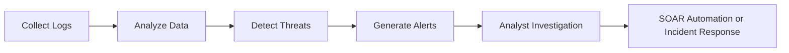

# 🛡️ Course 2 – Module 3: SIEM Tools & Security Operations (Part 1)

## 📖 Overview

Security Information and Event Management (SIEM) tools help security analysts monitor, analyze, and respond to security events by collecting and analyzing log data. This module also introduces the evolution of SIEM tools, Security Orchestration, Automation, and Response (SOAR), and the differences between open-source and proprietary cybersecurity tools.

---

# 📊 Security Information and Event Management (SIEM)

A **Security Information and Event Management (SIEM)** tool is an application that collects, stores, analyzes, and monitors **log data** from multiple systems to detect potential threats, risks, and vulnerabilities.

### Main Functions

- Collect log data
- Analyze security events
- Monitor systems in real time
- Detect threats and vulnerabilities
- Generate alerts
- Support incident investigations

> **Log:** A record of events occurring within an organization's systems.

---

# ⚙️ Current SIEM Solutions

Modern SIEM tools provide:

- Real-time monitoring
- Event correlation
- Security dashboards
- Threat detection
- Log analysis
- Alert generation

Although SIEM tools automate data collection and monitoring, **human analysts are still responsible for investigating and responding to security events.**

---

# ☁️ Evolution of SIEM

As organizations increasingly move to the cloud, SIEM solutions continue to evolve.

## Cloud-Hosted SIEM

Cloud-hosted SIEM solutions are managed by vendors.

### Characteristics

- Internet accessible
- Vendor maintains infrastructure
- Easy deployment
- Lower maintenance
- Suitable for organizations without dedicated infrastructure

---

## Cloud-Native SIEM

Cloud-native SIEM solutions are designed specifically for cloud environments.

### Advantages

- High availability
- Scalability
- Flexibility
- Cloud optimization
- Vendor managed

Cloud-native SIEM platforms fully utilize cloud computing capabilities rather than simply being hosted in the cloud.

---

# 🚀 Future of SIEM

Cybersecurity continues to evolve alongside modern technologies.

Future SIEM platforms are expected to improve through:

- Cloud computing
- Artificial Intelligence (AI)
- Machine Learning (ML)
- Internet of Things (IoT)
- Automation
- Platform integration

### Internet of Things (IoT)

IoT devices increase the number of internet-connected systems.

As IoT grows:

- Attack surface increases
- More logs are generated
- More data must be analyzed
- Threat detection becomes more complex

---

### Artificial Intelligence (AI) & Machine Learning (ML)

Future SIEM platforms will increasingly use AI and ML to:

- Detect suspicious activity faster
- Improve dashboard visualizations
- Identify threat patterns
- Enhance data analysis
- Improve threat classification

---

# 🤖 Security Orchestration, Automation, and Response (SOAR)

**SOAR** combines:

- Applications
- Automation
- Workflows
- Security tools

to automatically respond to common security incidents.

### Benefits

- Faster response times
- Reduced manual work
- Consistent incident handling
- Improved efficiency
- Allows analysts to focus on complex incidents

> SIEM identifies security events, while **SOAR automates the response** to many of those events.

---

# 🔄 SIEM vs SOAR

| SIEM | SOAR |
|------|------|
| Collects logs | Automates responses |
| Detects threats | Executes response workflows |
| Generates alerts | Performs predefined actions |
| Requires analyst investigation | Reduces manual intervention |

---

# 🧰 Open-Source vs Proprietary Tools

Cybersecurity professionals commonly use both **open-source** and **proprietary** tools.

Each has different advantages.

---

# 🌍 Open-Source Tools

Open-source software makes its source code publicly available.

### Characteristics

- Usually free
- Community developed
- Highly customizable
- Transparent
- Frequently improved by contributors

### Advantages

- Low cost
- Flexible
- Community support
- Publicly reviewed source code
- Rapid bug fixes

---

# 🏢 Proprietary Tools

Proprietary software is owned by a company or individual.

### Characteristics

- Commercial license
- Paid usage
- Vendor controlled
- Closed source

### Advantages

- Official support
- Professional training
- Regular vendor updates
- Enterprise features

### Limitations

- Less customization
- Update schedule controlled by vendor
- Licensing costs

Examples:

- Splunk Enterprise
- Splunk Cloud
- Google SecOps (Chronicle)

---

# ❌ Common Misconception

Many people believe proprietary software is always more secure than open-source software.

This is **not necessarily true.**

Open-source software is continuously reviewed by developers worldwide, allowing vulnerabilities to be identified and fixed quickly.

Because the source code is publicly available:

- Bugs are easier to identify
- Security improvements happen faster
- Community contributions strengthen security

---

# 📌 Key Takeaways (Part 1)

- SIEM tools collect, analyze, and monitor security logs.
- Current SIEM platforms still require human analysts.
- Cloud-hosted SIEM is vendor-managed and internet accessible.
- Cloud-native SIEM is optimized specifically for cloud environments.
- AI, ML, IoT, and automation will shape the future of SIEM.
- SOAR automates security responses and complements SIEM.
- Open-source tools provide flexibility and transparency.
- Proprietary tools provide vendor support and enterprise capabilities.

- ---

# 🐧 Open-Source Security Tools

## Linux

**Linux** is an open-source operating system widely used in cybersecurity due to its flexibility, stability, and powerful command-line interface (CLI).

### Features

- Open-source and customizable
- Uses a Command-Line Interface (CLI)
- Supports scripting and automation
- Commonly used by security professionals

### Common Uses

- System administration
- Security analysis
- Server management
- Penetration testing
- Automation

> **Operating System (OS):** Software that acts as the interface between computer hardware and the user.

---

## 🛡️ Suricata

**Suricata** is an open-source **network analysis and threat detection** tool developed by the **Open Information Security Foundation (OISF)**.

It inspects network traffic to detect suspicious activities and generate security logs.

### Features

- Network traffic inspection
- Intrusion detection
- Threat detection
- Log generation
- SIEM integration

### Benefits

- Detects malicious network behavior
- Identifies suspicious IP addresses
- Generates detailed logs
- Works with many SIEM platforms

---

# 📊 Splunk SIEM

**Splunk** is a widely used SIEM platform that collects, searches, monitors, and analyzes organizational log data.

### Versions

| Version | Description |
|---------|-------------|
| **Splunk Enterprise** | Self-hosted SIEM solution |
| **Splunk Cloud** | Cloud-hosted SIEM solution |

---

# 📈 Splunk Dashboards

Splunk provides multiple dashboards to help analysts monitor security events.

---

## 1️⃣ Security Posture Dashboard

Designed mainly for **Security Operations Centers (SOCs)**.

### Purpose

- Monitor the last 24 hours of security events
- View security trends
- Detect suspicious activity in real time

### Example

- Suspicious traffic from a specific IP address
- Unusual login attempts

---

## 2️⃣ Executive Summary Dashboard

Provides a high-level overview of the organization's security health.

### Used For

- Incident summaries
- Security trends
- Reports for management
- Long-term security monitoring

---

## 3️⃣ Incident Review Dashboard

Helps analysts investigate active security incidents.

### Features

- Incident timeline
- Suspicious activity patterns
- High-priority alerts

Useful for understanding how an attack developed.

---

## 4️⃣ Risk Analysis Dashboard

Focuses on identifying risky users, devices, or IP addresses.

### Detects

- Unusual login times
- Abnormal user behavior
- High network activity
- Risk score changes

Helps analysts prioritize remediation efforts.

---

# ☁️ Chronicle (Google SecOps)

**Chronicle** is Google's **cloud-native SIEM** platform.

It collects, stores, analyzes, and searches large volumes of security log data.

Logs can be analyzed by:

- Asset
- User
- Domain
- IP address

---

# 📊 Chronicle Dashboards

---

## 1️⃣ Enterprise Insights Dashboard

Displays recent alerts and identifies **Indicators of Compromise (IOCs)**.

### Shows

- Suspicious domains
- Threat confidence score
- Severity level

Used to quickly identify high-priority threats.

---

## 2️⃣ Data Ingestion & Health Dashboard

Monitors log collection and ingestion.

### Displays

- Number of logs received
- Log sources
- Processing success rate
- Data health

Ensures logs are collected without errors.

---

## 3️⃣ IOC Matches Dashboard

Tracks Indicators of Compromise over time.

### Includes

- Suspicious domains
- Malicious IP addresses
- Device indicators

Helps identify threat trends and prioritize investigations.

---

## 4️⃣ Main Dashboard

Provides an overall summary of security activity.

### Displays

- Event timeline
- Alerts
- Data ingestion
- Security activity trends

Useful for monitoring organizational security at a glance.

---

## 5️⃣ Rule Detections Dashboard

Displays alerts generated by security detection rules.

### Helps Analysts

- Identify recurring incidents
- Review alert frequency
- Prioritize severe detections

Example:

A rule triggers whenever a user opens a known malicious email attachment.

---

## 6️⃣ User Sign-In Overview Dashboard

Monitors user authentication behavior.

### Detects

- Multiple simultaneous logins
- Login attempts from unusual locations
- Suspicious user activity

Used to protect user accounts and organizational applications.

---

# 📊 Splunk vs Chronicle

| Feature | Splunk | Chronicle |
|---------|---------|------------|
| Deployment | Self-hosted & Cloud | Cloud-native |
| Main Focus | Log collection & analysis | Large-scale cloud log analysis |
| Dashboards | SOC, Executive, Incident, Risk | Enterprise Insights, IOC, Health, Rules, Sign-In |
| Best For | Enterprise SIEM | Cloud environments |

---

# 💡 Key Takeaways (Part 2)

- **Linux** is a widely used open-source operating system for cybersecurity.
- **Suricata** is an open-source network analysis and threat detection tool.
- **Splunk** provides multiple dashboards for monitoring security events and investigating incidents.
- **Chronicle** is Google's cloud-native SIEM platform designed for large-scale log analysis.
- SIEM dashboards help analysts quickly identify threats, investigate incidents, and prioritize remediation efforts.

  ---

# 📚 Module Summary

This module introduced **SIEM tools**, their evolution, and common cybersecurity tools used by security analysts. It also covered **Splunk** and **Google Chronicle** dashboards, showing how analysts use log data to monitor, investigate, and respond to security incidents.

---

# 🎯 Key Takeaways

## SIEM Tools

- Collect, store, and analyze **log data** from multiple sources.
- Provide **real-time monitoring** and **security alerts**.
- Help detect threats, risks, and vulnerabilities.
- Require analysts to investigate and respond to alerts.

---

## Evolution of SIEM

Modern SIEM platforms are evolving to support:

- ☁️ Cloud-hosted environments
- 🌐 Cloud-native architectures
- 🤖 Artificial Intelligence (AI)
- 🧠 Machine Learning (ML)
- 📡 Internet of Things (IoT)
- ⚡ Automation with SOAR

These improvements help organizations respond faster while reducing manual work.

---

## SOAR

**Security Orchestration, Automation, and Response (SOAR)** automates repetitive security tasks.

### Benefits

- Faster incident response
- Reduced manual intervention
- Consistent workflows
- Allows analysts to focus on complex investigations

---

## Open-Source vs Proprietary Tools

### Open-Source

**Advantages**

- Free or low cost
- Highly customizable
- Community maintained
- Transparent source code

**Examples**

- Linux
- Suricata

---

### Proprietary

**Advantages**

- Vendor support
- Professional training
- Enterprise features
- Regular updates

**Examples**

- Splunk Enterprise
- Splunk Cloud
- Google SecOps (Chronicle)

---

# 🖥️ SIEM Dashboards

## Splunk Dashboards

| Dashboard | Purpose |
|-----------|---------|
| **Security Posture** | Monitor recent security events and trends |
| **Executive Summary** | High-level overview of organizational security |
| **Incident Review** | Investigate incidents and review timelines |
| **Risk Analysis** | Identify high-risk users, devices, and IPs |

---

## Chronicle Dashboards

| Dashboard | Purpose |
|-----------|---------|
| **Enterprise Insights** | Monitor recent alerts and Indicators of Compromise (IOCs) |
| **Data Ingestion & Health** | Verify successful log collection and ingestion |
| **IOC Matches** | Track suspicious domains, IPs, and devices |
| **Main Dashboard** | View overall security activity and trends |
| **Rule Detections** | Review alerts triggered by detection rules |
| **User Sign-In Overview** | Monitor user authentication behavior |

---

# 📌 SIEM Workflow

---

# 📝 Complete Glossary

| Term | Definition |
|------|------------|
| **Chronicle** | A cloud-native SIEM tool from Google designed to retain, analyze, and search log data. |
| **Incident Response** | The process of identifying, containing, and recovering from a security incident. |
| **Log** | A record of events occurring within an organization's systems. |
| **Metrics** | Technical measurements such as response time, availability, and failure rate used to evaluate system performance. |
| **Operating System (OS)** | Software that acts as the interface between computer hardware and the user. |
| **Playbook** | A documented set of procedures used to respond to operational or security events. |
| **Security Information and Event Management (SIEM)** | A platform that collects, analyzes, and monitors log data to detect security threats. |
| **Security Orchestration, Automation, and Response (SOAR)** | A collection of tools and workflows that automate responses to security events. |
| **SIEM Tools** | Software platforms that collect, correlate, and analyze security data from multiple sources to detect and investigate threats. |
| **Splunk Cloud** | Cloud-hosted version of Splunk used for collecting, monitoring, and analyzing log data. |
| **Splunk Enterprise** | Self-hosted version of Splunk used to collect, search, analyze, and monitor organizational log data. |

---

# ✅ Module 3 Summary

By the end of this module, you should understand:

- ✔️ What SIEM tools are and why they are important.
- ✔️ How SIEM platforms collect and analyze log data.
- ✔️ The evolution of SIEM with cloud computing, AI, ML, IoT, and SOAR.
- ✔️ The differences between open-source and proprietary security tools.
- ✔️ The roles of **Linux** and **Suricata** in cybersecurity.
- ✔️ How **Splunk** and **Chronicle** dashboards help security analysts detect, investigate, and respond to threats.
- ✔️ Common cybersecurity terminology related to SIEM and incident response.
